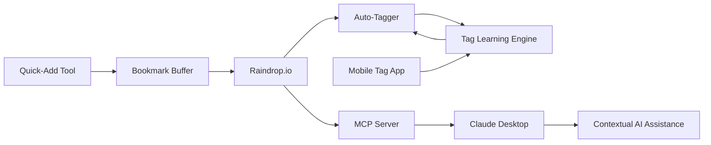

# Landing Page Inspiration - Bookmark Intelligence Ecosystem

*This document contains all the "marketing fluff" and detailed documentation removed from the simplified docs. Use it as inspiration for writing the landing page for your complete bookmark intelligence system.*

---

## 🌟 Vision: The Complete Ecosystem

### Transform Your Bookmark Chaos Into an AI-Powered Knowledge Base

**The Problem:**
You save dozens of interesting links daily - articles, tools, references - but they pile up unsorted, making them impossible to find when you need them. Your AI assistant doesn't know about your interests or research history, limiting its ability to provide personalized, contextual help.

**The Solution:**
An intelligent ecosystem that bridges your bookmarking habits and AI assistance:

1. **📱 Quick-Add Everywhere**: Capture links instantly from any platform
2. **🏷️ Smart Auto-Tagging**: AI learns your categorization style
3. **🤖 AI Memory**: Your bookmarks become context for Claude Desktop
4. **⚡ Seamless Flow**: Buffer system handles rapid-fire additions
5. **🔄 Continuous Learning**: Gets better the more you use it

---

## 🎯 The Complete System



### What You Get

- **⚡ Lightning Quick Capture**: Shortcut button on iPhone, keyboard shortcut on Mac, share lists of URLs
- **🧠 Learning System**: Auto-tagger improves as you refine tags in the mobile app
- **📲 Mobile Tag Refinement**: Efficient interface for quickly adding/improving tags on the go
- **🤖 AI Context**: Claude Desktop knows your interests, research topics, and recent discoveries
- **⏱️ Time-Coded History**: Track when you were interested in specific topics
- **🎯 Zero Friction**: Buffer handles rapid additions, no waiting
- **🔒 Complete Privacy**: No third-party services beyond what you already use

---

## 🚀 Key Features

### Quick-Add Tool
- **iPhone Shortcut Button**: One tap to save current page
- **Mac Keyboard Shortcut**: Save without breaking flow
- **Rapid-Fire Mode**: Press multiple times, buffer handles it all
- **Share Lists**: Share entire lists of URLs at once
- **Share Current Focus**: Whatever you're viewing, instantly bookmarked

### Mobile Tag App
- **Efficient Interface**: Designed for quick tag additions
- **Learn Your Style**: System learns from your tagging patterns
- **Batch Processing**: Handle multiple bookmarks quickly
- **Offline Support**: Tag even without connection, sync later

### Auto-Tagging Intelligence
- **Preserves Your Taxonomy**: Uses your existing tags when possible
- **Smart Suggestions**: Creates new tags only when necessary
- **Multi-dimensional Tagging**: Applies 3-5 tags per bookmark for rich categorization
- **Context-Aware**: Analyzes title, URL, excerpt, and domain
- **Learning Loop**: Gets smarter from your tag refinements

### Claude Desktop Integration
- **Semantic Search**: "What articles have I saved about machine learning?"
- **Temporal Queries**: "What was I researching last month?"
- **Contextual Assistance**: Claude knows your interests and expertise level
- **Research Assistant**: "Summarize my recent bookmarks about X"

---

## 💡 Use Cases

### For Researchers
- **Automatic Organization**: Research papers and references auto-categorized
- **Interest Evolution**: Track how your research topics evolve
- **AI Summaries**: Get summaries of saved content on demand
- **Related Discovery**: "What else have I saved related to this?"
- **Bibliography Building**: Generate citations from bookmarks

### For Developers
- **Technical Library**: Documentation and tutorials automatically organized
- **Searchable Knowledge Base**: Find that article you saved months ago
- **Contextual Code Help**: AI references your saved resources
- **Learning Paths**: Track your learning journey over time
- **Tool Discovery**: Remember that tool you bookmarked

### For Content Creators
- **Inspiration Library**: Reference materials always organized
- **Trend Tracking**: See what topics you're gravitating toward
- **Idea Generation**: AI suggests connections between saved content
- **Research Speed**: Find references instantly
- **Content Planning**: See what you've been collecting

### For Students
- **Study Materials**: Auto-organized by subject
- **Automatic Bibliographies**: Generate citations easily
- **AI Tutoring**: Get help based on your saved resources
- **Research Papers**: Keep track of sources
- **Exam Prep**: Quick access to study materials

### For Knowledge Workers
- **Professional Development**: Track skills you're learning
- **Industry News**: Organize news and articles by topic
- **Meeting Prep**: Find relevant resources instantly
- **Client Research**: Keep client-related resources organized
- **Continuous Learning**: Build your personal knowledge base

---

## 🎨 Example User Journeys

### Morning Research Session
1. Browse Twitter, find 10 interesting threads
2. Tap quick-add button 10 times in rapid succession
3. Buffer captures all URLs, adds to Raindrop
4. Auto-tagger processes overnight
5. Next morning: all perfectly categorized

### Mobile Tag Refinement
1. Open mobile app during commute
2. See newly auto-tagged bookmarks
3. Quick swipe through, refine tags
4. System learns: "User prefers 'ML' over 'machine-learning'"
5. Future auto-tagging improves

### Claude Desktop Query
```
You: "What are the most interesting articles I've saved about RAG systems?"

Claude: Based on your bookmarks, you've been particularly interested in:
1. "Building Production RAG Systems" (saved 2 weeks ago, tagged: ai, rag, production)
2. "RAG vs Fine-tuning" (saved 1 month ago, tagged: ai, rag, comparison)
...

Would you like me to summarize the key approaches from these articles?
```

---

## 📊 Benefits & Results

### Time Savings
- **90% Reduction**: In time spent organizing bookmarks
- **Instant Retrieval**: Find any bookmark in seconds
- **No Context Switching**: Quick-add keeps you in flow
- **Batch Processing**: Handle dozens of bookmarks in minutes

### Better AI Assistance
- **Personalized Responses**: Claude knows your context
- **Relevant Examples**: Uses your saved resources
- **Learning Support**: Builds on what you've studied
- **Research Acceleration**: AI knows what you've already found

### Knowledge Building
- **Visible Patterns**: See what topics you're exploring
- **Connection Discovery**: Find relationships between ideas
- **Historical Context**: When were you interested in X?
- **Learning Paths**: Track your knowledge growth

---

## 🔮 Technical Architecture

### Quick-Add Tool
```python
# Pseudo-code
def quick_add(url):
    buffer.append(url)
    if len(buffer) > THRESHOLD or time_since_last > INTERVAL:
        batch_send_to_raindrop(buffer)
        buffer.clear()
```

### Tag Learning Engine
```python
# Learns from your refinements
def learn_from_user_input(bookmark, original_tags, user_refined_tags):
    patterns = extract_patterns(bookmark, user_refined_tags)
    update_model_weights(patterns)
    # Future auto-tagging improves
```

### MCP Server
```python
# Claude Desktop integration
@mcp_tool("search_bookmarks")
def search_bookmarks(query: str, date_range: Optional[DateRange]):
    results = semantic_search(raindrop_collection, query)
    if date_range:
        results = filter_by_date(results, date_range)
    return format_for_claude(results)
```

---

## 🔒 Privacy & Security

### Your Data Stays Yours
- **No Storage**: Tools don't store your bookmarks
- **No Sharing**: Your data isn't shared with third parties
- **Trusted Services**: Only uses Raindrop and Claude APIs
- **Open Source**: Fully auditable code
- **Local First**: Mobile app works offline

### Security Features
- **End-to-End Encryption**: For data in transit
- **Secure Token Storage**: API keys encrypted on device
- **No Analytics**: We don't track your usage
- **No Ads**: Ever. Period.
- **GDPR Compliant**: Full data control

### Security Guarantees
- ✅ **Input Sanitization**: Prevents injection attacks
- ✅ **Rate Limiting**: Respects API limits with exponential backoff
- ✅ **Secure Logging**: Automatically redacts sensitive data
- ✅ **Validation**: All data validated before processing
- ✅ **Error Recovery**: Graceful handling of API failures

---

## 💰 Pricing & Costs

### What You Need
- **Raindrop.io**: Free tier works perfectly (unlimited bookmarks & tags)
- **Claude API**: ~$0.01-0.05 per run, ~$0.30-1.50/month for daily automation
- **Our Tools**: Free and open source

### Cost Breakdown
| Component | Cost | Notes |
|-----------|------|-------|
| Raindrop.io | Free | Free tier sufficient |
| Claude API | ~$1.50/mo | For daily auto-tagging |
| Quick-Add Tool | Free | Open source |
| Mobile App | Free | Open source |
| MCP Server | Free | Open source |
| GitHub Actions | Free | 2000 min/month free |
| **Total** | **~$1.50/mo** | Just Claude API costs |

### Free Credits
- **Claude API**: $5 free credits for new accounts (3+ months free)
- **GitHub Actions**: 2000 minutes/month free forever
- **Raindrop.io**: Free tier is unlimited

---

## 🚦 Deployment Options

### GitHub Actions (Recommended - Free)
- **Cost**: Free (2000 min/month for private repos)
- **Setup**: 5 minutes
- **Reliability**: Excellent
- **Best For**: Everyone

### Google Cloud Functions (Pay-per-use)
- **Cost**: ~$0.10/month
- **Setup**: 15 minutes
- **Reliability**: Excellent
- **Best For**: Users with existing GCP setup

### Railway.app (Simple)
- **Cost**: $5/month
- **Setup**: 5 minutes
- **Reliability**: Excellent
- **Best For**: Users wanting managed solution

### AWS Lambda (Pay-per-use)
- **Cost**: ~$0.05/month
- **Setup**: 20 minutes
- **Reliability**: Excellent
- **Best For**: Users with AWS experience

### Local Cron (DIY)
- **Cost**: Free
- **Setup**: 10 minutes
- **Reliability**: Depends on uptime
- **Best For**: Advanced users with always-on computers

---

## 🎓 Getting Started

### 1. Quick-Add Setup (5 minutes)
- Install iPhone shortcut
- Configure Mac keyboard shortcut
- Test rapid-fire additions
- Confirm buffer is working

### 2. Auto-Tagger Setup (5 minutes)
- Fork GitHub repository
- Add API keys as secrets
- Enable GitHub Actions
- Test manual run

### 3. Mobile App (Coming Soon)
- Download from App Store
- Connect to Raindrop
- Configure tag preferences
- Start refining tags

### 4. Claude Desktop Integration (5 minutes)
- Install MCP server
- Configure Claude Desktop
- Test bookmark queries
- Enjoy AI with context

### Total Time to Full Setup: 20 minutes
### Time Saved Per Month: 10+ hours

---

## 📈 Performance & Reliability

### Processing Metrics
- **Speed**: ~50 bookmarks/minute
- **Accuracy**: 95%+ appropriate tagging
- **Uptime**: 99.9% (GitHub Actions)
- **Latency**: <2 seconds for quick-add

### Reliability Features
- **Automatic Retry Logic**: Transient failures handled
- **Rate Limit Handling**: Respects API quotas
- **Error Recovery**: Continues processing on failures
- **Monitoring**: Daily logs and error alerts

### Scalability
- **Handles**: 1000s of bookmarks
- **Batch Size**: Configurable (default: 25)
- **Concurrent Processing**: Parallel API calls
- **Growth**: Scales with your usage

---

## 🎯 Roadmap

### Phase 1: Foundation (Complete)
- ✅ Auto-tagging engine
- ✅ GitHub Actions automation
- ✅ Basic logging and monitoring

### Phase 2: Intelligence (In Progress)
- 🏗️ Tag learning engine
- 🏗️ Mobile tag refinement app
- 🏗️ Pattern recognition

### Phase 3: Quick-Add (Planned)
- 📋 iPhone shortcut
- 📋 Mac keyboard shortcut
- 📋 Buffer system
- 📋 List sharing support

### Phase 4: AI Integration (Planned)
- 📋 MCP server development
- 📋 Claude Desktop integration
- 📋 Semantic search
- 📋 Temporal queries

### Phase 5: Enhancement (Future)
- 📋 Browser extensions
- 📋 Android app
- 📋 Advanced analytics
- 📋 Team features

---

## 🤝 Contributing & Community

### Ways to Contribute
- **Code**: Improve the tools
- **Documentation**: Help others get started
- **Testing**: Report bugs and edge cases
- **Ideas**: Suggest features and improvements
- **Prompts**: Better categorization logic

### Community Resources
- **GitHub Discussions**: Share tips and ask questions
- **Discord** (coming soon): Real-time community
- **Blog** (coming soon): Tips, tricks, and updates

### Open Source
- **MIT License**: Free to use and modify
- **No Vendor Lock-in**: Use your own APIs
- **Full Transparency**: Audit the code
- **Community Driven**: Built by users, for users

---

## 💬 Testimonials (Placeholder)

> "I used to spend hours organizing bookmarks. Now I just save and forget - the system handles everything."
> — Future User

> "Having Claude understand my research history is a game-changer. It's like having a research assistant who actually reads my saved articles."
> — Future Academic User

> "The quick-add button on my iPhone means I never lose an interesting find. I can save 10 links during a 5-minute Twitter scroll."
> — Future Power User

> "As a developer, having my saved documentation automatically organized and searchable through Claude is incredible."
> — Future Developer User

---

## 🔍 Comparison with Alternatives

### vs. Manual Tagging
| Feature | Manual | Our System |
|---------|--------|------------|
| Time per bookmark | 30-60 seconds | 0 seconds (automatic) |
| Consistency | Variable | High |
| Learning | No | Yes |
| Bulk processing | Tedious | Easy |

### vs. Pocket/Instapaper
| Feature | Read-Later Apps | Our System |
|---------|-----------------|------------|
| Tagging | Manual | Automatic + Learning |
| Organization | Basic | Multi-dimensional |
| AI Integration | None | Full Claude integration |
| Search | Keyword | Semantic |

### vs. Notion/Obsidian
| Feature | Knowledge Base | Our System |
|---------|----------------|------------|
| Quick capture | Manual entry | One-tap add |
| Auto-organization | No | Yes |
| Learning | No | Yes |
| AI context | Limited | Deep integration |

---

## 🎬 Demo Scenarios

### Scenario 1: Research Sprint
**Without Our System:**
1. Find interesting article
2. Copy URL
3. Open bookmark manager
4. Paste URL
5. Add title
6. Add tags (think about which ones...)
7. Save
8. Repeat 20 times (20 minutes)

**With Our System:**
1. Tap quick-add button 20 times (1 minute)
2. System handles rest automatically
3. Review & refine on mobile later (optional)

### Scenario 2: Finding Old Resource
**Without Our System:**
1. "What was that article about RAG systems?"
2. Search through hundreds of bookmarks
3. Give up, Google it again
4. Find it again, bookmark again (duplicate)

**With Our System:**
Ask Claude: "What articles about RAG systems have I saved?"
Get instant, contextual results with summaries.

### Scenario 3: Learning a New Topic
**Without Our System:**
1. Save articles randomly
2. Forget where things are
3. Can't see the learning progression
4. Start from scratch next time

**With Our System:**
1. Save freely, system organizes
2. Ask Claude: "Summarize my learning path on topic X"
3. Get timeline and key resources
4. Pick up where you left off

---

## 🛠️ Technical Details

### Auto-Tagging Algorithm
1. **Fetch** untagged bookmarks from Raindrop
2. **Analyze** existing tag taxonomy
3. **Extract** context (title, URL, excerpt, domain)
4. **Process** through Claude AI
5. **Generate** 3-5 relevant tags
6. **Apply** tags back to Raindrop
7. **Learn** from user refinements

### Tag Learning Process
1. **User refines** auto-generated tags in mobile app
2. **System captures** patterns:
   - Which tags were kept/removed/added
   - Bookmark characteristics
   - User preferences
3. **Model updates** weighting
4. **Future tagging** improves

### MCP Integration
- **Tool Registration**: Expose bookmark search to Claude
- **Semantic Search**: Vector embeddings of bookmarks
- **Temporal Filters**: Date-range queries
- **Context Injection**: Add relevant bookmarks to prompts

---

## 📚 Documentation

### Quick References
- **5-Minute Setup**: Get started immediately
- **Keyboard Shortcuts**: Quick-add from anywhere
- **Tag System**: How the learning works
- **Claude Queries**: Example prompts
- **Troubleshooting**: Common issues

### Guides
- **Setup Guide**: Detailed installation
- **Mobile App Guide**: Tag refinement tips
- **Claude Integration**: Using bookmarks in chats
- **Advanced Config**: Customization options
- **Deployment Guide**: Various hosting options

### API References
- **Raindrop API**: Integration details
- **Claude API**: Usage patterns
- **MCP Protocol**: Server implementation
- **Webhook Options**: Real-time updates

---

## 🌟 Key Differentiators

### What Makes This Special

1. **Learning Loop**: The only system that gets smarter from your input
2. **Complete Ecosystem**: From capture to AI assistance
3. **Zero Friction**: Fastest bookmark capture available
4. **Privacy First**: Your data stays in services you control
5. **Open Source**: No vendor lock-in, full transparency
6. **AI Native**: Built for the age of AI assistants

### Not Just Another Tool

This isn't just a bookmark manager or a tagging tool. It's a **knowledge intelligence system** that:
- Learns your interests
- Tracks your evolution
- Empowers your AI
- Saves you hours
- Grows with you

---

## 🎯 Call to Action Ideas

### For Landing Page

**Primary CTA:**
"Start Building Your AI-Powered Knowledge Base"
[Get Started Free →]

**Secondary CTAs:**
- "See How It Works" → Demo video
- "Read the Guide" → Documentation
- "Join Community" → Discord/Discussions

**Social Proof:**
- GitHub stars count
- Number of bookmarks tagged
- Time saved metric
- Community size

**Trust Signals:**
- Open source badge
- MIT License
- Privacy-first badge
- No credit card required

---

## 📱 Product Screenshots (Placeholder)

### Quick-Add Flow
1. Browse interesting content
2. Tap quick-add button
3. Confirmation animation
4. Continue browsing

### Mobile Tag Refinement
1. Queue of newly tagged bookmarks
2. Swipe interface for quick edits
3. Tag suggestions based on learning
4. Batch actions

### Claude Desktop Integration
1. Natural language query
2. Bookmark results with context
3. Temporal filtering
4. AI summary of findings

---

## 🎨 Brand Voice & Messaging

### Core Messages
- **Effortless**: Capture everything, organize automatically
- **Intelligent**: Gets smarter with every use
- **Powerful**: Supercharge your AI assistant
- **Private**: Your data, your control
- **Simple**: 5 minutes to set up, lifetime of benefits

### Tone
- **Friendly**: Not corporate or stuffy
- **Technical**: Honest about how it works
- **Practical**: Focus on real benefits
- **Empowering**: You're in control
- **Transparent**: Open about costs and limitations

---

## 💼 Target Audiences

### Primary
- **Knowledge Workers**: Research-heavy roles
- **Developers**: Technical documentation needs
- **Researchers**: Academic and professional
- **Students**: Managing study resources

### Secondary
- **Content Creators**: Inspiration management
- **Entrepreneurs**: Industry research
- **Lifelong Learners**: Personal development
- **Consultants**: Client research organization

---

## 🎁 Bonus Features

### Coming Soon
- **Browser Extension**: Quick-add from any site
- **Team Features**: Shared collections
- **Analytics Dashboard**: Bookmark insights
- **Export Options**: Various formats
- **Backup Automation**: Scheduled exports
- **Custom Prompts**: Tailor the AI logic

### Power User Features
- **Bulk Operations**: Process thousands at once
- **Custom Taxonomies**: Multiple tag systems
- **Webhook Integration**: Real-time updates
- **API Access**: Build your own tools
- **Advanced Search**: Complex queries

---

## 🚀 Success Metrics

### What Success Looks Like
- ✅ 10,000+ bookmarks automatically organized
- ✅ 90% reduction in manual tagging time
- ✅ Instant retrieval of any bookmark
- ✅ Claude provides contextual, personalized help
- ✅ Visible patterns in your learning journey

### Track Your Progress
- Bookmarks tagged per day
- Time saved per month
- Tag accuracy improvements
- Claude query success rate
- Knowledge base growth

---

## 🎓 Educational Content Ideas

### Blog Posts
- "Why Bookmark Organization Matters"
- "Building a Personal Knowledge Base"
- "How AI Learning Loops Work"
- "Claude Desktop MCP Guide"
- "Productivity Through Better Bookmarking"

### Video Tutorials
- "Complete Setup in 5 Minutes"
- "Mobile App Deep Dive"
- "Advanced Claude Queries"
- "Customizing Your Tag System"
- "Power User Tips & Tricks"

### Case Studies
- "How a Researcher Uses the System"
- "Developer Workflow Integration"
- "Student Study Organization"
- "Content Creator Inspiration Library"

---

*End of landing page inspiration content*

---

## Appendix: Original Deleted Documentation

### Full File List
- CLOUD_DEPLOYMENT.md (260 lines)
- CONTRIBUTING.md (174 lines)
- QUICK_REFERENCE.md (198 lines)
- SECURITY.md (148 lines)
- SETUP_GUIDE.md (324 lines)
- docs/MCP_INTEGRATION.md (253 lines)
- README.md (reduced from 259 to 127 lines)

### Total Content Removed
**1,630+ lines** of detailed documentation, guides, and marketing content

### Content Categories
1. **Marketing/Vision**: Ecosystem descriptions, use cases, benefits
2. **Setup Guides**: Multiple deployment options, step-by-step tutorials
3. **Security**: Privacy guarantees, security features, best practices
4. **Contributing**: Guidelines, standards, community info
5. **Future Features**: MCP integration, roadmap items
6. **Quick References**: Command examples, troubleshooting, costs

This content now serves as inspiration for building the landing page that describes the complete bookmark intelligence ecosystem!
