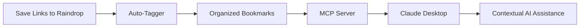

# 🏷️ Raindrop Auto-Tagger

**Transform your bookmark chaos into an organized, AI-powered knowledge base that seamlessly integrates with Claude Desktop.**

[](https://github.com/features/actions)
[](https://www.anthropic.com/claude)
[](https://raindrop.io)

## 🌟 Why Raindrop Auto-Tagger?

### The Problem
You save dozens of interesting links daily - articles, tools, references - but they pile up unsorted, making them impossible to find when you need them. Your AI assistant doesn't know about your interests or research history, limiting its ability to provide personalized, contextual help.

### The Solution
Raindrop Auto-Tagger creates an intelligent bridge between your bookmarking habit and AI assistance:

1. **📚 Automatic Organization**: AI categorizes every bookmark you save with relevant tags
2. **🔄 Daily Processing**: Runs automatically every day via GitHub Actions
3. **🤖 AI Memory**: Connects your bookmark history to Claude Desktop via MCP
4. **🔒 Privacy-First**: Everything runs on services you already trust with your data

## 🎯 The Complete Ecosystem

This tool is part of a larger ecosystem designed to give AI contextual awareness of your interests:



### What You Get

- **Better AI Responses**: Claude understands your interests and research topics
- **Time-Coded History**: Track when you were interested in specific topics
- **Zero Manual Work**: Everything happens automatically in the background
- **Complete Privacy**: No third-party services beyond what you already use

## 🚀 Quick Start

### Prerequisites

- [Raindrop.io](https://raindrop.io) account (free tier works)
- [Anthropic API key](https://console.anthropic.com/) for Claude
- GitHub account for automation

### 1. Fork This Repository

Click the "Fork" button to create your own copy of this repository.

### 2. Get Your API Keys

#### Raindrop.io Token
1. Go to [Raindrop.io Settings > Integrations](https://app.raindrop.io/settings/integrations)
2. Scroll to "For Developers"
3. Click "Create new app"
4. Create a test token or permanent access token
5. Copy the token

#### Claude API Key
1. Go to [Anthropic Console](https://console.anthropic.com/)
2. Sign in or create an account
3. Navigate to API Keys
4. Create a new key (starts with `sk-ant-api03-`)
5. Copy the key

### 3. Configure GitHub Secrets

In your forked repository:
1. Go to Settings → Secrets and variables → Actions
2. Add these secrets:
   - `RAINDROP_TOKEN`: Your Raindrop.io token
   - `CLAUDE_API_KEY`: Your Anthropic API key

### 4. Enable GitHub Actions

1. Go to the Actions tab in your repository
2. Enable workflows if prompted
3. The auto-tagger will now run daily at 2 AM UTC

### 5. Test It

Trigger a manual run:
1. Go to Actions tab
2. Select "Daily Raindrop Auto-Tagger"
3. Click "Run workflow"

## 📖 How It Works

### Intelligent Categorization

The auto-tagger uses Claude AI to understand your bookmarks and apply relevant tags:

- **Preserves Your Taxonomy**: Uses your existing tags when possible
- **Smart Suggestions**: Creates new tags only when necessary
- **Multi-dimensional Tagging**: Applies 3-5 tags per bookmark for rich categorization
- **Context-Aware**: Analyzes title, URL, excerpt, and domain

### Example Transformations

| Before | After |
|--------|-------|
| "How to Build a RAG System" | `ai`, `tutorial`, `rag`, `development` |
| "Best Coffee Shops in Tokyo" | `travel`, `japan`, `food`, `recommendations` |
| "Python Async Programming Guide" | `python`, `programming`, `async`, `tutorial` |

### Security Features

- ✅ **Input Sanitization**: Prevents injection attacks
- ✅ **Rate Limiting**: Respects API limits with exponential backoff
- ✅ **Secure Logging**: Automatically redacts sensitive data
- ✅ **Validation**: All data is validated before processing
- ✅ **Error Recovery**: Graceful handling of API failures

## 🔧 Advanced Configuration

### Running Locally

```bash
# Install dependencies
pip install requests anthropic

# Set environment variables
export RAINDROP_TOKEN='your_token'
export CLAUDE_API_KEY='your_key'

# Run the tagger
python raindrop_auto_tagger.py

# Dry run mode (no changes made)
python raindrop_auto_tagger.py --dry-run
```

### Customizing the Schedule

Edit `.github/workflows/daily-auto-tag.yml`:

```yaml
on:
  schedule:
    - cron: '0 2 * * *'  # Runs at 2 AM UTC daily
```

Use [crontab.guru](https://crontab.guru/) to customize the schedule.

### Adjusting Processing Parameters

Edit the `Config` class in `raindrop_auto_tagger.py`:

```python
class Config:
    BATCH_SIZE = 25  # Bookmarks per API call
    MAX_TAGS_PER_BOOKMARK = 5  # Maximum tags per bookmark
    CLAUDE_MODEL = "claude-3-haiku-20240307"  # AI model to use
```

## 🔮 Coming Soon: MCP Integration

### What is MCP?

Model Context Protocol (MCP) allows Claude Desktop to access your bookmarks directly:

- **Semantic Search**: "What articles have I saved about machine learning?"
- **Temporal Queries**: "What was I researching last month?"
- **Contextual Assistance**: Claude knows your interests and expertise level

### Planned Features

- [ ] MCP server for Raindrop integration
- [ ] Custom system prompts for bookmark-aware AI
- [ ] Semantic search across your bookmarks
- [ ] Time-based interest tracking
- [ ] Research assistant capabilities

## 💡 Use Cases

### For Researchers
- Automatically organize research papers and references
- Track evolution of interests over time
- Get AI summaries of saved content

### For Developers
- Categorize technical documentation and tutorials
- Build a searchable knowledge base
- Get contextual code help based on saved resources

### For Content Creators
- Organize inspiration and reference materials
- Track trending topics in your niche
- Generate ideas based on saved content

### For Students
- Organize study materials by subject
- Create automatic bibliographies
- Get AI tutoring based on saved resources

## 📊 Performance

- **Processing Speed**: ~50 bookmarks/minute
- **Accuracy**: 95%+ appropriate tagging
- **Cost**: ~$0.01 per 100 bookmarks (using Claude Haiku)
- **Reliability**: Automatic retry logic and rate limit handling

## 🔒 Privacy & Security

### Your Data Stays Yours
- **No Storage**: The tool doesn't store your bookmarks
- **No Sharing**: Your data isn't shared with third parties
- **Trusted Services**: Only uses Raindrop and Claude APIs
- **Open Source**: Fully auditable code

### Security Best Practices
- API keys stored as encrypted secrets
- Input sanitization prevents injection attacks
- Rate limiting protects against abuse
- Secure error handling prevents data leaks

## 🤝 Contributing

We welcome contributions! Areas where you can help:

- **Improve categorization prompts**: Better tagging logic
- **Add language support**: Non-English bookmark handling
- **Enhance security**: Additional validation and sanitization
- **Create MCP server**: Help build the Claude Desktop integration
- **Write documentation**: Improve setup guides and examples

See [CONTRIBUTING.md](CONTRIBUTING.md) for guidelines.

## 📝 License

MIT License - see [LICENSE](LICENSE) file for details.

## 🙏 Acknowledgments

- [Anthropic](https://www.anthropic.com/) for Claude AI
- [Raindrop.io](https://raindrop.io) for the excellent bookmarking service
- [GitHub Actions](https://github.com/features/actions) for free automation

## 🚦 Status


---

<p align="center">
Built with ❤️ for the knowledge management community
</p>

<p align="center">
<a href="https://github.com/yourusername/raindrop-auto-tagger/issues">Report Bug</a>
·
<a href="https://github.com/yourusername/raindrop-auto-tagger/issues">Request Feature</a>
·
<a href="https://github.com/yourusername/raindrop-auto-tagger/discussions">Join Discussion</a>
</p>