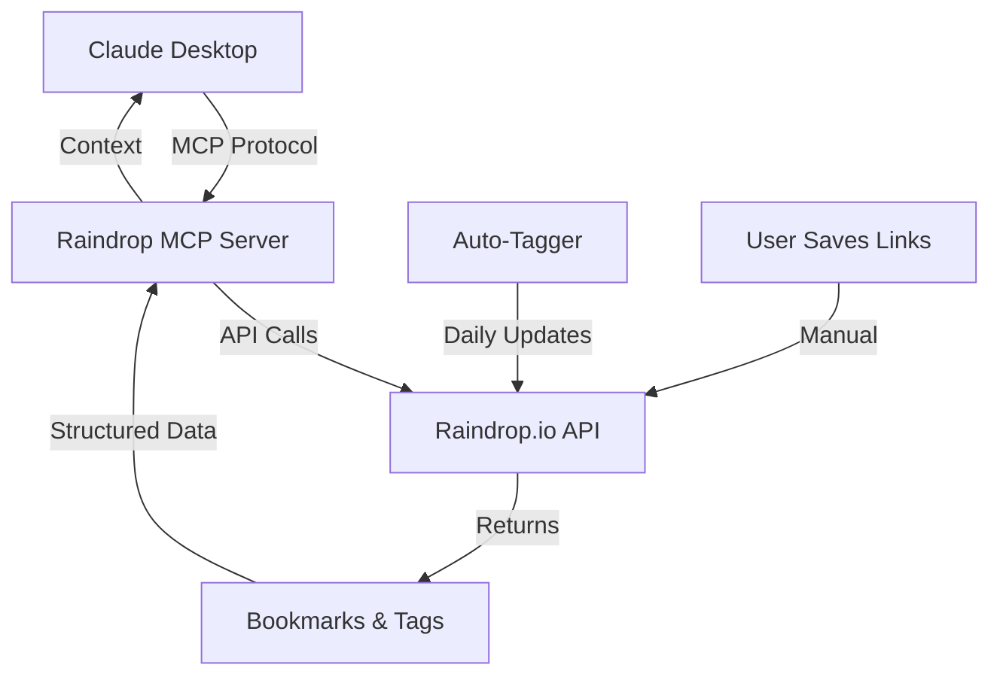

# MCP Server Integration for Raindrop.io

## Overview

The Model Context Protocol (MCP) server will enable Claude Desktop to directly access and search your Raindrop bookmarks, creating a personalized AI assistant that understands your interests and research history.

## Architecture



## Planned Features

### Phase 1: Basic Integration (MVP)
- [ ] **Search Bookmarks**: Query bookmarks by tags, title, or content
- [ ] **List Recent**: Show recently added bookmarks
- [ ] **Get by Tag**: Retrieve all bookmarks with specific tags
- [ ] **Temporal Queries**: Find bookmarks from specific time periods

### Phase 2: Advanced Features
- [ ] **Semantic Search**: Natural language queries across bookmarks
- [ ] **Interest Timeline**: Track topic interests over time
- [ ] **Content Analysis**: Summarize saved articles
- [ ] **Related Links**: Find related bookmarks using embeddings

### Phase 3: Intelligence Layer
- [ ] **Research Assistant**: Help with research based on saved materials
- [ ] **Knowledge Graph**: Build connections between bookmarks
- [ ] **Smart Recommendations**: Suggest related content
- [ ] **Export Capabilities**: Generate reports from bookmarks

## MCP Server Implementation

### Server Structure
```python
# mcp_server.py
from mcp import Server, Tool, Resource

class RaindropMCPServer(Server):
    """MCP server for Raindrop.io integration"""

    def __init__(self, raindrop_token: str):
        self.raindrop = RaindropClient(raindrop_token)
        super().__init__()

    @Tool("search_bookmarks")
    async def search(self, query: str, tags: List[str] = None):
        """Search bookmarks by query and/or tags"""
        pass

    @Tool("get_recent")
    async def recent(self, limit: int = 10):
        """Get recently added bookmarks"""
        pass

    @Tool("analyze_interests")
    async def interests(self, timeframe: str = "month"):
        """Analyze bookmark trends over time"""
        pass
```

### Configuration
```json
{
  "mcpServers": {
    "raindrop": {
      "command": "python",
      "args": ["-m", "raindrop_mcp_server"],
      "env": {
        "RAINDROP_TOKEN": "${RAINDROP_TOKEN}"
      }
    }
  }
}
```

## System Prompts

### Research Assistant
```markdown
You have access to my Raindrop bookmark collection through MCP. Use this to:
- Understand my interests and expertise level
- Reference materials I've saved when answering questions
- Suggest related resources from my collection
- Track how my interests have evolved over time
```

### Knowledge Navigator
```markdown
I save interesting links to Raindrop daily. When I ask questions:
1. Check if I have relevant bookmarks saved
2. Consider the timeline of when I saved related content
3. Use bookmark context to gauge my familiarity with topics
4. Reference specific bookmarks when relevant
```

## Use Cases

### Academic Research
```
User: "What papers have I saved about transformer architectures?"
Claude: *searches bookmarks* "You have 12 papers on transformers saved between March and October, including 'Attention Is All You Need' and recent papers on efficient transformers..."
```

### Project Planning
```
User: "I'm starting a new ML project. What resources have I collected?"
Claude: *analyzes tags* "Based on your bookmarks, you have resources on PyTorch (23), model deployment (15), and MLOps (8). Your most recent saves focus on distributed training..."
```

### Learning Path
```
User: "How has my interest in web3 evolved?"
Claude: *temporal analysis* "Your web3 bookmarks show a progression: Starting with basics in January, moving to DeFi in March, and recently focusing on smart contract security..."
```

## Privacy & Security

### Data Flow
- **Local Processing**: MCP server runs locally on your machine
- **No Storage**: Server doesn't persist data beyond sessions
- **Token Security**: Raindrop token never leaves your machine
- **Read-Only**: MCP server only reads, never modifies bookmarks

### Permissions Model
```yaml
permissions:
  read:
    - bookmarks
    - tags
    - collections
  write: []  # No write permissions
  delete: []  # No delete permissions
```

## Development Roadmap

### Q1 2025
- [ ] Basic MCP server implementation
- [ ] Search and retrieval tools
- [ ] Claude Desktop integration guide

### Q2 2025
- [ ] Semantic search capabilities
- [ ] Interest tracking features
- [ ] Performance optimizations

### Q3 2025
- [ ] Knowledge graph construction
- [ ] Advanced analytics
- [ ] Export and reporting tools

## Technical Specifications

### API Endpoints Used
- `GET /raindrops/{collection}`: Fetch bookmarks
- `GET /tags`: Get all tags
- `GET /search`: Search functionality
- `GET /stat`: Statistics and analytics

### Response Caching
- Cache duration: 5 minutes for searches
- Cache invalidation: On new bookmark detection
- Memory limit: 100MB per session

### Performance Targets
- Search latency: <500ms
- Bulk retrieval: <2s for 1000 bookmarks
- Memory usage: <200MB active

## Contributing

We welcome contributions to the MCP server! Priority areas:

1. **Core Server**: Help implement the basic MCP server
2. **Search Algorithms**: Improve search relevance
3. **Analytics**: Build interest tracking features
4. **Documentation**: Create user guides and examples

## Example Interactions

### Daily Briefing
```python
# System prompt addition
"Start each conversation by checking my recent bookmarks from the last 24 hours to understand what I'm currently interested in."
```

### Research Mode
```python
# When researching a topic
"Before answering questions, search my bookmarks for relevant saved materials and incorporate them into your response."
```

### Learning Assistant
```python
# For educational queries
"Gauge my knowledge level based on the complexity of bookmarks I've saved on this topic."
```

## Future Possibilities

### Integration with Other Tools
- **Obsidian**: Export bookmarks as notes
- **Notion**: Sync with databases
- **Readwise**: Connect highlights

### AI Enhancements
- **Auto-summarization**: Generate summaries of saved articles
- **Topic Clustering**: Automatically group related bookmarks
- **Trend Detection**: Identify emerging interests

### Collaboration Features
- **Shared Collections**: Team bookmark spaces
- **Recommendation Engine**: Suggest bookmarks to team members
- **Knowledge Base**: Build organizational memory

## Getting Started with Development

```bash
# Clone the repository
git clone https://github.com/yourusername/raindrop-mcp-server

# Install dependencies
pip install mcp-python raindrop-api anthropic

# Set up environment
export RAINDROP_TOKEN="your_token"

# Run the server
python -m raindrop_mcp_server

# Test with Claude Desktop
# Add server configuration to Claude Desktop settings
```

## Resources

- [MCP Documentation](https://github.com/anthropics/mcp)
- [Raindrop API Docs](https://developer.raindrop.io/)
- [Claude Desktop Guide](https://claude.ai/desktop)

---

*This document outlines the vision for MCP integration. Join us in making it a reality!*